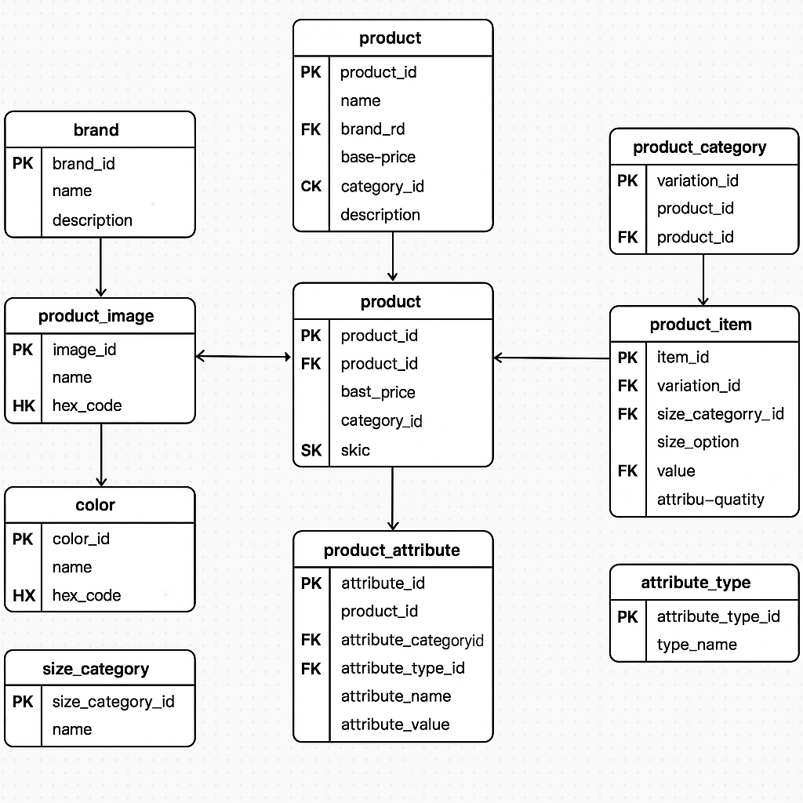

## 🛒 E-commerce Database Architecture




## 📦 Project Overview

This project showcases a fully normalized relational database designed to support a scalable e-commerce platform.  
Our team collaboratively designed the Entity-Relationship Diagram (ERD), implemented the schema in SQL, and added sample data and queries to demonstrate real-world functionality.

...

### 🛒 `README.md`

````markdown
# 🛍️ E-commerce Database Design

## 📦 Project Overview

This project showcases a fully normalized relational database designed to support a scalable e-commerce platform.  
Our team collaboratively designed the Entity-Relationship Diagram (ERD), implemented the schema in SQL, and added sample data and queries to demonstrate real-world functionality.

---

## 📘 Contents

- `ecommerce.sql`: Full SQL schema (table creation + sample data)
- `ERD.png`: Entity-Relationship Diagram of the database
- `README.md`: Project documentation
- `sample_query.sql`: SQL query to retrieve full product details

---

## 🧠 Key Features

- ✅ Product & brand management
- 🎨 Variations by color and size
- 📏 Size categories for clothes & shoes
- 🧵 Custom product attributes (like material, storage, etc.)
- 🖼️ Product images
- 🔄 Normalized structure with strong relational integrity

---

## 🧰 Tables Overview

| Table                | Description                                     |
| -------------------- | ----------------------------------------------- |
| `brand`              | Stores brand info (e.g., Nike, Apple)           |
| `product_category`   | Categories like clothing, electronics           |
| `product`            | General product info (linked to brand/category) |
| `product_image`      | Image URLs for each product                     |
| `color`              | Available colors                                |
| `product_variation`  | Intermediate between product and item           |
| `product_item`       | Actual SKU with color/size/stock                |
| `size_category`      | Shoe sizes, clothing sizes, etc.                |
| `size_option`        | S, M, L, 42, etc.                               |
| `product_attribute`  | Custom attributes (e.g., material)              |
| `attribute_category` | Groups for attributes                           |
| `attribute_type`     | Data type of attribute (text, number, boolean)  |

---

## 📊 Sample Query Output

> Get full product detail including brand, category, price, stock, color, size, image, and attributes.

```sql
SELECT
    p.name AS product_name,
    b.name AS brand,
    pc.name AS category,
    pi.sku,
    pi.price,
    pi.stock_quantity,
    c.name AS color,
    so.value AS size,
    pa.attribute_name,
    pa.attribute_value,
    img.image_url
FROM
    product p
LEFT JOIN brand b ON p.brand_id = b.brand_id
LEFT JOIN product_category pc ON p.category_id = pc.category_id
LEFT JOIN product_variation pv ON p.product_id = pv.product_id
LEFT JOIN product_item pi ON pv.variation_id = pi.variation_id
LEFT JOIN color c ON pi.color_id = c.color_id
LEFT JOIN size_option so ON pi.size_option_id = so.size_option_id
LEFT JOIN product_attribute pa ON p.product_id = pa.product_id
LEFT JOIN product_image img ON p.product_id = img.product_id;
```
````

---

## 🧑‍🤝‍🧑 Team Members GROUP 7

- [Lewis Gitonga Muriuki]

---

## 📬 How to Use

1. Clone the repo
2. Open the SQL file in MySQL Workbench or another RDBMS
3. Run schema & data insert commands
4. Explore with the sample SELECT queries

---

## 🛠️ Tools Used

- MySQL Workbench
- dbdiagram.io / Lucidchart
- GitHub

---

## 🚀 License

This project is for academic purposes only.

```
